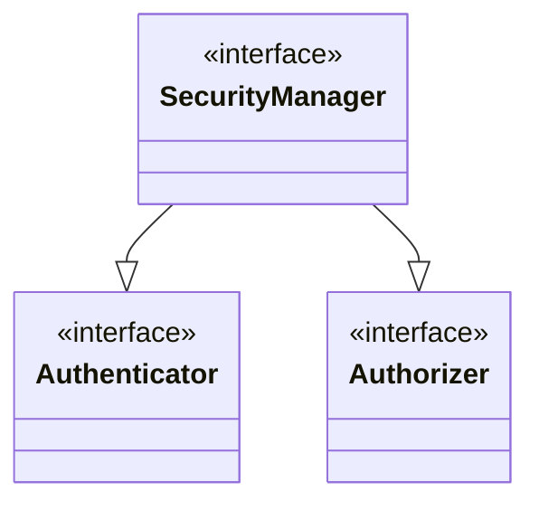

在学习Shiro的之前，需要了解Shiro相关的术语。

* Subject 使用应用的实体总称。可以是一个用户、一个服务、一个进程等。
  * Identity Subject的唯一标识，通常可以是邮箱和手机号
  * Credential Subject用来证明自己Identity的信息。比如密码、生物识别信息（指纹等）
* Authentication 即验证当前Subject的Identity和其提供的Credentials是否匹配
* Authorization 也叫做访问控制，决定一个主体是否可以做什么操作。
  * Permission 许可是最基本的安全策略，是对行为或者显示地描述在应用可以做什么的基本声明。
  * Role 是许可的集合，同时关联用户，决定用户可以做什么。
* Realm 一般对应一个数据源。认证和授权都是通过Realm获取数据。

!!! note
    Shiro对Authorization和OAuth 2.0的定义是有区别的。在OAuth 2.0语境下，授权是指第三方应用可以代替用户拥有哪些权限。使用`scope`字段表示用户授予第三方应用的权限。

## Permission的粒度级别

Shiro对permission定义了三个级别：

* Resource Level 用户可以开房间的所有的门
* Instance Level 用户可以看主卧的门
* Attribute Leve 对资源或者实例的某些属性的访问权限

文档[Understanding Permissions in Apache Shiro](https://shiro.apache.org/permissions.html)解释了Shiro的权限的用法。

## 架构

<figure markdown>
  { width="600" }
  <figcaption>Shiro的架构</figcaption>
</figure>

## 使用

Shiro的核心就是`SecurityManager`来完成认证、授权的流程。

