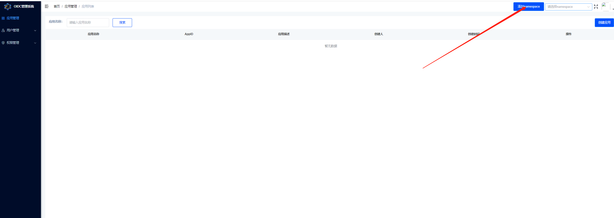
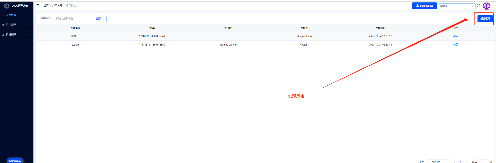
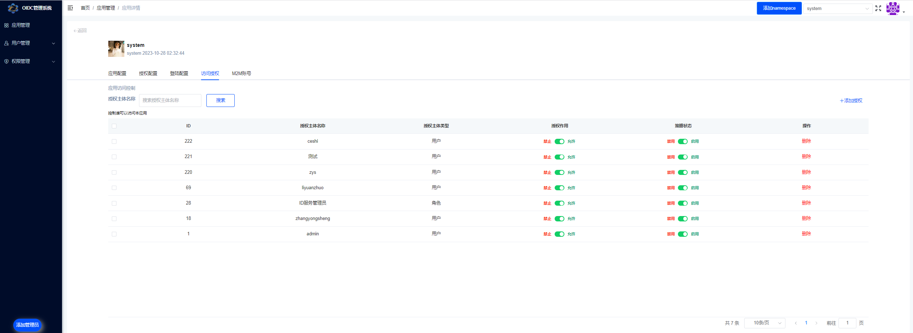
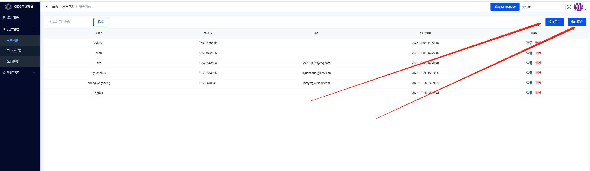

# 快速开始

## 命名空间创建

通过管理员授权后获取登录系统的权限后，登录系统。然后创建命名空间。

创建成功后，系统会自动切换到新创建的命名空间。

## 应用接入

在左侧点击应用管理，进入当前命名空间的已注册应用的列表。在列表有上方注册按钮，点击即可注册应用。

注册应用主要是获取OAuth2.0登录的`client_id`和`client_secret`。

### 配置登录

* 配置回调地址 在OAuth 2.0中如果使用授权码模式，需要配置回调地址

### 授权配置

* **授权配置** 应用默认只开启授权码模式。如果选择了授权码模式，一定要配置回调地址
* **Token过期时间配置** 按需设置授权码和Token的过期时间

## 应用授权

应用授权即为用户、用户组、组织和部门授予登录当前应用的权限。当应用注册后，需要在这里给用户授权后方可登录。

## 用户接入

Diana目前没有接入任何第三方的用户源（比如企业微信，公司的OA系统），所以目前用户都是管理员手动创建的。Diana的定位不是提供IDaaS服务，所以一个Diana实例只服务一家公司或者组织。

从左边导航栏的用户管理/用户列表菜单进入用户列表页，在右上角有添加用户和创建用户两个按钮。

* **添加用户** 所有登录Diana系统的用户、所有命名空间的管理员都会放在全局的用户池中。添加用户即从这个用户池选择用户加入到当前命名空间下
* **创建用户** 为当前命名空间创建一个新用户，同时同步到全局用户池中

## 权限管理

