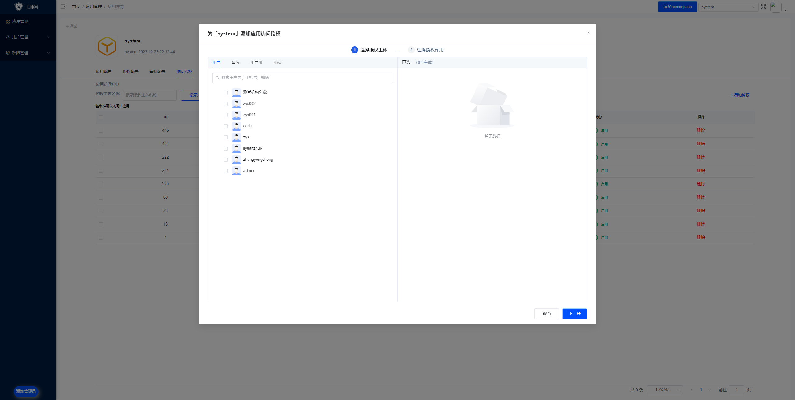
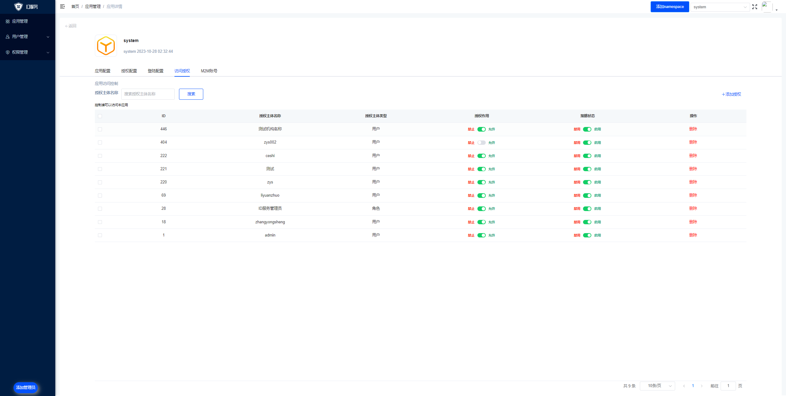

# 应用

在Diana中，一个应用可以看做是OAuth 2.0中的第三方应用，或者是OIDC中的RP（Replying Party）。第三方服务如果想要使用Diana的认证、授权和访问控制必须首先在Diana注册一个应用。

应用的配置主要需要注意授权和机器人账号。

## 应用授权

应用授权是应用赋予用户、用户组、组织和机构对当前应用的访问权限。

在Diana中通常将用户、用户组、组织和结构统称为主体。

点击右上角的添加主体，即可主体进行授权。

添加主体后，即可对授权测试和作用进行设置。

* **策略状态** 即当前授权规则是否生效
* **授权作用** 即当前授权规则如果生效，是允许还是禁止主体访问

