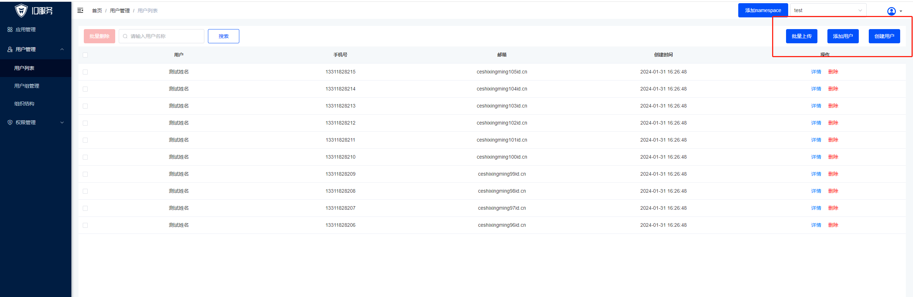
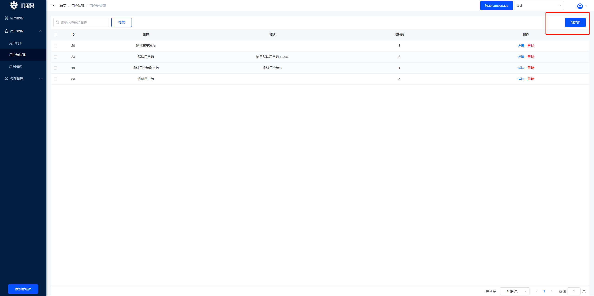
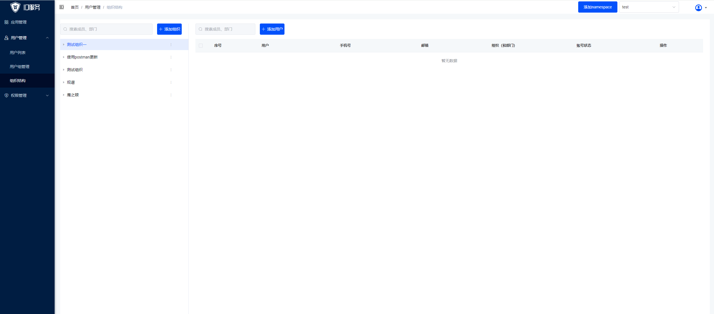
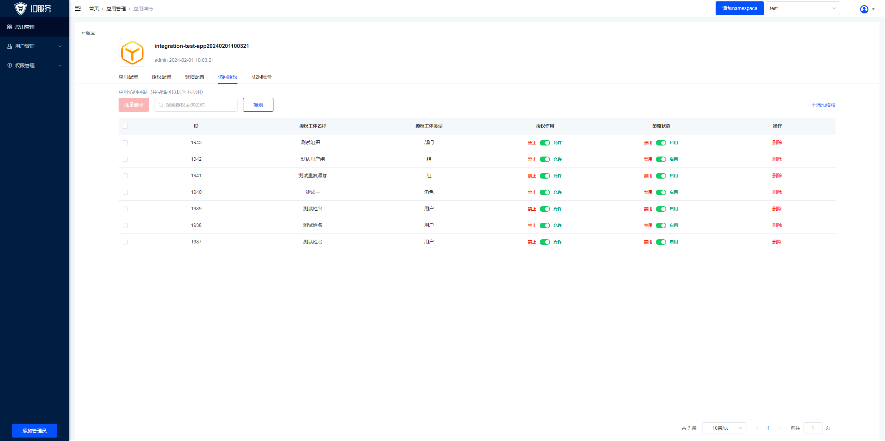

ID服务提供以下功能：

* 用户组
* 组织

Diana目前没有接入任何第三方的用户源（比如企业微信，公司的OA系统），所以目前用户都是管理员手动创建或者通过Excel文件批量导入。

## 用户来源
在一个命名空间下，用户来源有三个：

* 手动创建
* 从全局用户池导入
* 批量上传

<figure markdown>
  
  <figcaption>用户添加入口</figcaption>
</figure>

## 用户组
可以创建用户组，以用户组的维度来进行应用的访问控制和资源的访问控制。

<figure markdown>
  
  <figcaption>用户组列表</figcaption>
</figure>

## 组织

组织主要是以层级的方式对用户进行分组。

<figure markdown>
  
  <figcaption>组织结构列表</figcaption>
</figure>

## 应用访问控制

可以从用户、用户组和组织结构的维度对应用进行访问控制的配置。

<figure markdown>
  
  <figcaption>应用访问授权</figcaption>
</figure>